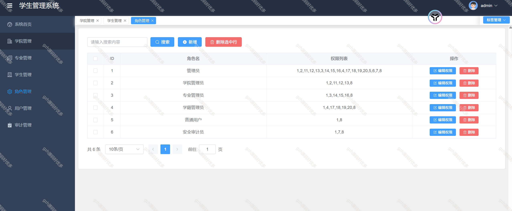

# python032
python032基于Python+Vue3的教务学生信息管理系统
 
## 查看主页获取源码

### 一、关键词
学生信息系统、教务学生信息管理系统

 

### 二、作品包含

源码+数据库+设计文档+全套环境和工具资源+部署教程

 

### 三、项目技术

前端技术：Vue3 + pinia + Element Plus+Echarts+Axios
后端技术：Python3+Flask
  

 

### 四、运行环境（以下版本亲测，其他版本未知，请自测）

开发工具：PyCharm + VSCODE

数据库：MySQL8

数据库管理工具：Navicat10+

Python：Python3.8

前端Nodejs：18

浏览器：谷歌浏览器

 

### 五、项目介绍

项目编号：python032

 本报告旨在阐述一种高效、用户友好的学生信息管理系统的设计与实现方案，该系统旨在为教育机构提供一个集中的平台，以简化学生信息管理流程，提高信息处理的准确性和效率

 本系统覆盖了数据大屏可视化展示、学生基本信息管理、学院管理、专业管理、角色管理、用户管理以及审计管理等多个核心功能模块，旨在满足高校管理人员、教师以及学生等不同用户群体的需求。

 

### 六、运行截图

